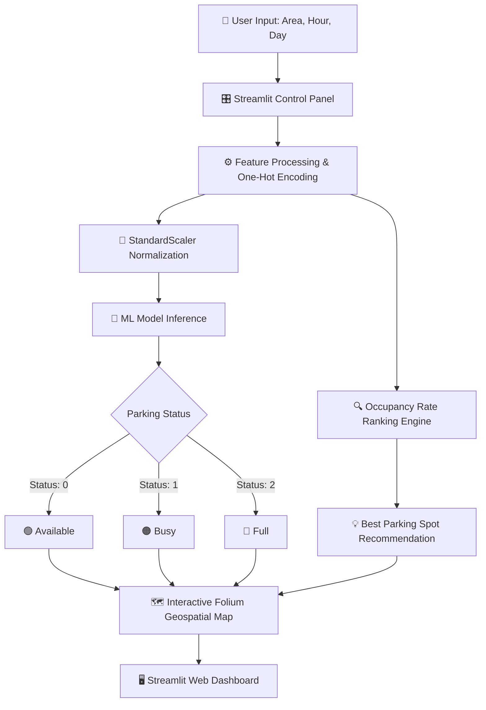

<div align="center">

  # 🚗 Smart Parking Recommendation System
  ### *AI-Powered Real-Time Parking Availability & Geospatial Navigation*

  [](https://www.python.org/)
  [](https://streamlit.io/)
  [](https://scikit-learn.org/)
  [](https://python-visualization.github.io/folium/)
  [](LICENSE)

  <br />

  <p align="center">
    <b>Transforming urban mobility with predictive analytics and intelligent parking spot recommendation.</b>
    <br />
    <a href="#-key-features"><strong>Explore Features »</strong></a>
    ·
    <a href="#-quick-start"><strong>Quick Start</strong></a>
    ·
    <a href="#-system-architecture"><strong>Architecture</strong></a>
  </p>

</div>

---

> [!NOTE]
> **Smart Parking Recommendation System** solves urban traffic congestion by forecasting parking availability across high-density city sectors using trained Machine Learning classification models and interactive geospatial rendering.

---

## 📑 Table of Contents

- [✨ Overview](#-overview)
- [🌟 Key Features](#-key-features)
- [🏗️ System Architecture](#%EF%B8%8F-system-architecture)
- [⚡ Tech Stack](#-tech-stack)
- [🚀 Quick Start](#-quick-start)
- [🎯 Machine Learning Pipeline](#-machine-learning-pipeline)
- [📂 File Structure](#-file-structure)
- [🤝 Contributing](#-contributing)
- [📄 License](#-license)

---

## ✨ Overview

Searching for parking in congested city zones wastes time, increases fuel consumption, and aggravates traffic gridlock. This project delivers an end-to-end **Smart Parking Recommendation & Visualization Engine** that:

1. **Predicts Real-Time Status**: Uses historical occupancy metrics, hour-of-day, and day-of-week feature arrays to predict if a sector is `Available 🟢`, `Busy 🟠`, or `Full 🔴`.
2. **Recommends Optimal Spots**: Sorts candidate parking venues by lowest occupancy rate to maximize the driver's chance of finding immediate parking.
3. **Displays Geospatial Maps**: Renders color-coded interactive **Folium** maps with real-time popup indicators tailored to the selected area.

---

## 🌟 Key Features

| Feature | Description | Status |
| :--- | :--- | :---: |
| 🔮 **Predictive Analytics** | Machine Learning model (`parking_model.pkl`) predicts parking status based on time & temporal patterns. | ✅ Active |
| 💡 **Smart Advice Engine** | Ranks nearby spots by lowest occupancy rate to surface optimal recommendations. | ✅ Active |
| 🗺️ **Interactive Folium Maps** | Dynamically centered interactive maps with color-coded status pins & custom tooltips. | ✅ Active |
| 🎛️ **Intuitive Control Panel** | Streamlit sidebar controls for instant area selection, hour slider (0-23), and day of the week. | ✅ Active |
| ⚡ **Optimized Asset Caching** | High-performance model & dataset loading via `@st.cache_resource` for zero latency. | ✅ Active |

---

## 🏗️ System Architecture



---

## ⚡ Tech Stack

<div align="center">

| Core Technology | Badge / Framework | Purpose |
| :--- | :--- | :--- |
| **Language** |  | Core Logic & ML Scripting |
| **UI Framework** |  | Web Dashboard & Interactive Elements |
| **Geospatial** |  | Map Generation & Marker Overlays |
| **Machine Learning** |  | Model Training & Feature Scaling |
| **Data Processing** |  | Data Wrangling & Feature Engineering |
| **Model Serialization** |  | Fast Model & Scaler Persistence |

</div>

---

## 🚀 Quick Start

> [!TIP]
> Ensure you have **Python 3.8+** installed before proceeding with the setup.

### 1. Clone Repository

```bash
git clone https://github.com/Ramaalodat/Smart_parking.git
cd Smart_parking
```

### 2. Environment Setup

Create a virtual environment and activate it:

```bash
# Windows
python -m venv venv
.\venv\Scripts\activate

# Linux / macOS
python3 -m venv venv
source venv/bin/activate
```

### 3. Install Requirements

```bash
pip install streamlit pandas joblib folium streamlit-folium scikit-learn
```

### 4. Run Application

```bash
streamlit run app.py
```

The application will launch on your local host:
`http://localhost:8501`

---

## 🎯 Machine Learning Pipeline

```
┌─────────────────┐    ┌─────────────────┐    ┌──────────────────┐
│  Raw Dataset    │───>│ Feature Scaling │───>│ Trained Model    │
│ (Occupancy Rate)│    │ (parking_scaler)│    │ (parking_model)  │
└─────────────────┘    └─────────────────┘    └──────────────────┘
                                                        │
                                                        ▼
                                             ┌──────────────────┐
                                             │ Status Prediction│
                                             │ Available/Busy/Full│
                                             └──────────────────┘
```

- **Features**: `hour`, `day_of_week`, area categorical dummy variables (`area_*`).
- **Target Label**:
  - `0`: **Available** (Low Occupancy)
  - `1`: **Busy** (Moderate Occupancy)
  - `2`: **Full** (High / Complete Occupancy)
- **Primary Metrics**: Optimizes area classification accuracy and mini-batch inference speed.

---

## 📂 File Structure

```gfm
📦 Smart_parking
 ┣ 📜 app.py                  # Main Streamlit Application & Map Renderer
 ┣ 📜 final_merged_fixed.csv  # Preprocessed Parking Dataset
 ┣ 📜 parking_model.pkl       # Serialized Machine Learning Model
 ┣ 📜 parking_scaler.pkl      # Scaler Artifact for Input Normalization
 ┣ 📜 README.md               # Professional System Documentation
 ┗ 📂 .snapshots              # Project Configurations & Backup Snapshots
```

---

## 🤝 Contributing

Contributions make the open-source community an incredible place to learn, inspire, and create. Any contributions you make are **greatly appreciated**.

1. Fork the Project (`https://github.com/Ramaalodat/Smart_parking/fork`)
2. Create your Feature Branch (`git checkout -b feature/AmazingFeature`)
3. Commit your Changes (`git commit -m 'Add some AmazingFeature'`)
4. Push to the Branch (`git push origin feature/AmazingFeature`)
5. Open a Pull Request

---

## 📄 License

Distributed under the **MIT License**. See `LICENSE` for more information.

<div align="center">

  Designed with ❤️ for Smart Cities & Urban Mobility

</div>
